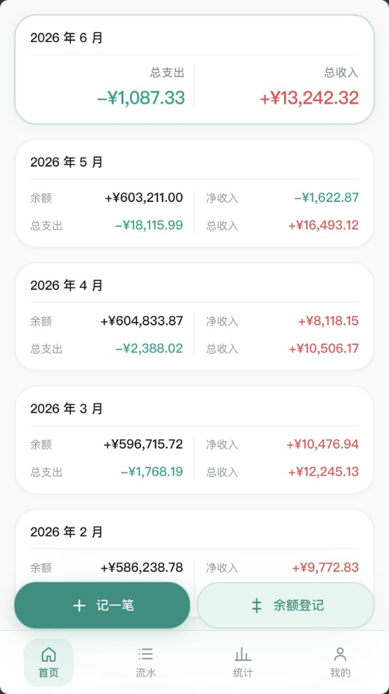
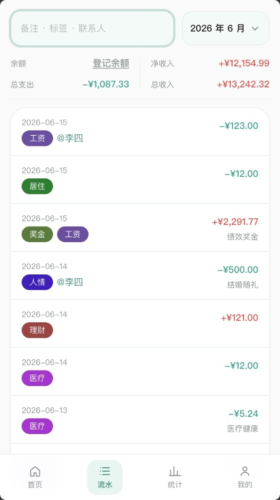
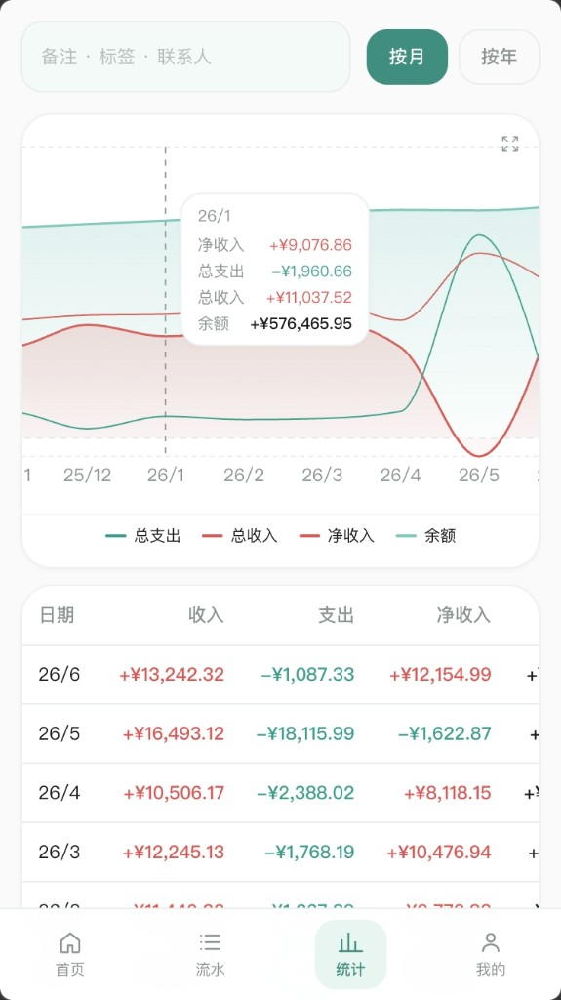
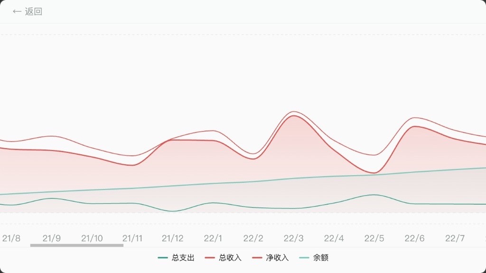
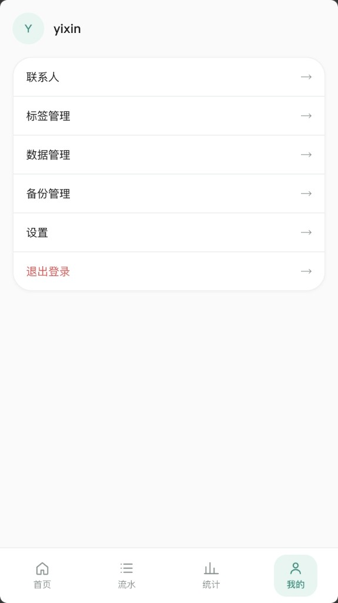

[English](docs/readme/en.md) · [简体中文](README.md) · [日本語](docs/readme/ja.md)

# 轻账单

轻量、自托管、多用户个人记账 Web 应用。

## 特性

- **自托管多用户**：数据保存在本机 SQLite，每用户独立账本；支持 Docker 部署与飞牛 NAS（fnOS）安装包
- **收支流水**：记录收入/支出，支持标签、联系人、备注、日期；按月浏览，游标分页与关键词搜索
- **月度余额**：登记每月实际账户余额，与流水汇总对照
- **日常支出**：按月估算未逐笔记账的日常开销，自动计入总支出
- **联系人**：关联任意流水，详情页汇总往来金额
- **统计分析**：月/年维度图表，按标签、联系人、备注筛选；支持全屏查看与数据表格
- **数据迁移**：账本 CSV 导出与导入，便于备份与迁移
- **多语言**：多语言界面（20 种语言完整翻译）
- **个性化**：收支配色（红涨绿跌 / 绿涨红跌）可切换
- **移动友好**：响应式布局、底部导航、下拉刷新，可安装为 PWA

## 系统截图

### 首页 · 月度账单



### 流水 · 按月浏览与搜索



### 统计 · 图表与明细



### 统计 · 全屏横屏查看



### 我的 · 标签 / 数据 / 备份



## 快速开始

```bash
cp .env.example .env
docker compose up -d --build
```

打开 [http://localhost:8080](http://localhost:8080) ，注册账号即可使用。

## 本地开发

**后端：**

```bash
export DATA_DIR=./data
export GOPROXY=https://goproxy.cn,direct
go mod download    # 先拉齐依赖（只需成功一次）
go run ./cmd/server

# 或使用脚本（已内置 GOPROXY）：
# ./scripts/dev-backend.sh
```

也可永久设置 Go 代理（本机一次即可）：

```bash
go env -w GOPROXY=https://goproxy.cn,direct
```

**前端：**

```bash
cd web && npm install && npm run dev
```

前端 dev server 会将 `/api` 代理到 `:8080`。

## 飞牛 NAS（fnOS）打包

轻账单可打包为 fnOS 原生 `.fpk` 安装包，在飞牛 NAS 上直接运行进程，无需 Docker。

### 构建要求

- Go 1.22+（交叉编译 `linux/amd64` 或 `linux/arm64`）
- Node.js + npm（若 `web/out` 不存在，脚本会自动执行 `npm run build`）
- `curl`（首次构建时自动下载官方 `fnpack` 到 `.fnos-shared/`）

### 构建安装包

在项目根目录执行：

```bash
# x86 NAS（默认）
./scripts/build-fpk.sh 1.0.6

# ARM NAS
./scripts/build-fpk.sh 1.0.6 arm

# 同时构建 x86 与 ARM
./scripts/build-fpk.sh 1.0.6 all
```

产物位于 `dist/minibill_<version>_<platform>.fpk`。

脚本会依次：编译 Linux 后端二进制 → 复制前端静态资源与数据库迁移 → 调用 `fnpack` 打包。

### 安装与配置

1. 登录 fnOS → **应用中心** → **手动安装**
2. 上传与 NAS 架构匹配的 `.fpk` 文件
3. 安装向导中设置 **服务端口**（默认 `18080`）及是否开放注册
4. 数据目录选择数据盘（勿选系统盘）
5. 安装完成后从桌面图标或 `http://<NAS-IP>:<端口>` 访问（首次启动自动生成 JWT 密钥）

修改端口 / 注册开关 / 备份目录：应用中心 → 轻账单 → **应用设置** → **运行设置** → **编辑** → 保存（保存后会自动重启应用）。

**备份目录：** 应用中心 → 轻账单 → **应用设置** → **运行设置** → **编辑**，填写绝对路径（如 `/vol1/1000/backups`）；留空则不启用备份。保存后会自动重启应用，随后在 Web **我的 → 备份管理** 配置定时备份。

卸载时可选保留账本数据（应用数据目录下的 `system.db` 与各用户 `ledger.db`）。

更多部署细节见 [部署指南](docs/deploy.md)。

## 文档

- [API](docs/api.md)
- [部署](docs/deploy.md)
- [发版清单](docs/release.md)

## 技术栈

Go + Gin + SQLite | Next.js + Tailwind + Recharts | Docker
